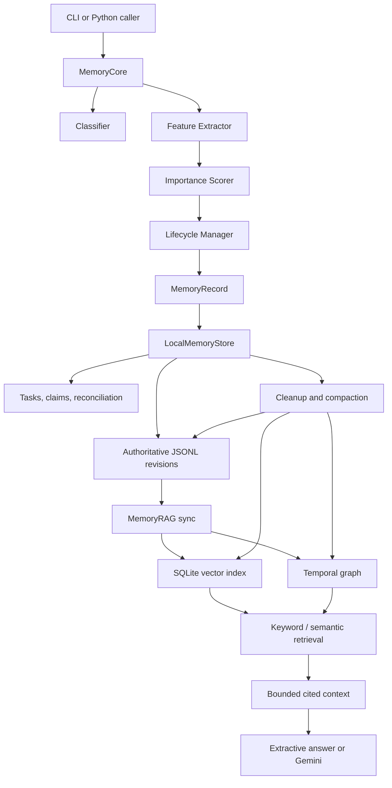

# CogniMem — Complete Documentation

## Purpose

CogniMem is a local-first memory system for personalized AI agents. It turns raw
conversation messages into structured memories, decides how  useful they are,
keeps revision history, retrieves relevant evidence later, and can generate
cited answers from that evidence.

It is designed to answer questions a plain transcript cannot answer well:
which messages should persist, which fact is current after an update, whether a
task remains open, which evidence supports an answer, and what the system knew
at a past time. It is a Python memory-core implementation with a local authenticated HTTP/demo surface; production database migration and deployment remain separate concerns.

## What it builds

CogniMem provides these connected capabilities:

| Capability | What it does |
| --- | --- |
| Memory core | Converts a message into a normalized, serializable memory record. |
| Classification | Labels content as temporary, semantic, preference, episodic, procedural, or task. |
| Importance and lifecycle | Scores usefulness and assigns working, short-term, long-term, or archive tiers. |
| Task memory | Tracks creation, completion, cancellation, rescheduling, deadlines, and recurrence. |
| Reconciliation | Detects supported contradictory claims and preserves current and historical evidence. |
| Consolidation | Reduces exact/compatible repeated memories while retaining provenance. |
| Local store | Uses append-only JSONL as the authoritative memory history. |
| Retrieval | Supports keyword, semantic, graph, and hybrid retrieval. |
| RAG | Builds bounded, cited evidence context; can answer extractively or through Gemini. |
| Knowledge graph | Stores typed, time-aware relationships with source evidence. |
| Cleanup | Safely removes eligible expired memories and derived index data. |
| ML experiment | Offers an optional XGBoost importance scorer; it is not the default. |

Not currently provided: production database migration, automated scheduler installation, general-purpose relation extraction, or independently human-rated answer quality.

## Architecture



The key invariant is that JSONL revisions are authoritative. SQLite vectors and
graph data are rebuildable derived indexes. An index failure must never be the
only loss of a memory.

## Source layout

```text
main/
  __main__.py              CLI
  application/             MemoryCore and maintenance worker
  domain/                  models, rules, lifecycle, tasks, reconciliation
  storage/                 JSONL store, SQLite indexes, cleanup, locks
  retrieval/               ranker, embeddings, RAG, generation
  graph/                   temporal graph and graph contract
  ml.py                    optional trained-scorer integration
training/                  optional importance-model training
tests/                     unit and integration tests
docs/                      focused guides and reports
data/                      datasets, caches, and local artifacts
```

Use new module paths directly: `main.application.core`,
`main.domain.models`, `main.storage.store`, `main.retrieval.rag`, and
`main.graph.temporal`. Old flat compatibility source modules were removed.

## Install and configure

```bash
uv venv --python 3.13 .venv
uv pip install --python .venv/bin/python -r requirements.txt
```

For Gemini, create a repository-root `.env`:

```dotenv
GOOGLE_API_KEY=your_key_here
COGNIMEM_GEMINI_MODEL=gemini-2.5-flash
```

`GEMINI_API_KEY` is accepted as a fallback. Environment variables take
precedence over `.env`. The key is ignored by Git. Local FastEmbed embeddings
do not send memory text to an embedding provider; Gemini receives only the
question and selected context when hosted generation is intentionally used.

Runtime locations:

- JSONL store: `memory_store/memories.jsonl`
- SQLite index: beside the store, normally `memories.index.sqlite3`
- embedding cache: `data/rag/models`
- reports: `docs/reports/`
- local configuration: `.env`

## Basic use

```bash
python3 -m main process "I prefer concise Python explanations" \
  --user-id joseph --session-id s1 --pretty

python3 -m main list --user-id joseph --pretty
python3 -m main search "Python explanation style" --user-id joseph --pretty
python3 -m main get MEMORY_ID --pretty
python3 -m main history MEMORY_ID --user-id joseph --pretty
python3 -m main stats --pretty
```

Use `--no-save` with `process` to inspect a result without writing JSONL.
Normal reads hide expired, superseded, consolidated, completed, and cancelled
records when appropriate. Use `--include-expired`, `--include-resolved`, or
`--include-history` for deliberate inspection.

## Real-world use and day-to-day integration

CogniMem is most useful when an assistant, internal tool, or workflow repeatedly
works with the same person, project, or team. It should run beside the agent
that receives messages; it is not meant to replace a company system of record.
For each integration, choose a stable `user_id` and a session ID for each chat,
meeting, or work thread.

| Work setting | Memories to retain | How CogniMem helps day to day |
| --- | --- | --- |
| Personal work assistant | Preferred writing style, active projects, reminders, constraints. | Starts each request with relevant preferences and open tasks rather than asking again. |
| Engineering copilot | Repository conventions, deployment steps, incidents, owners, project dependencies. | Retrieves prior decisions and shows graph-backed evidence for “who owns this?” questions. |
| Meeting assistant | Decisions, actions, deadlines, attendees, and later corrections. | Turns follow-up messages into task revisions and preserves the original decision trail. |
| Customer-success assistant | Customer preferences, stated goals, product constraints, and commitments. | Keeps customer-specific context isolated by `user_id` and supports cited answers to account questions. |
| Research assistant | Research interests, claims, sources, projects, and relationships. | Uses hybrid retrieval for prior notes and graph paths for supported people/project relationships. |
| Personal productivity tool | Recurring routines, single reminders, completed work, and changing deadlines. | Maintains active task state instead of repeatedly resurfacing completed work. |

### Recommended integration loop

For every incoming message, create a `MemoryInput`, process it, and ingest it.
Before generating an assistant response, retrieve a small evidence set for the
current question. Use extractive context during development and Gemini only when
the answer requires synthesis.

```python
from pathlib import Path

from main.application.core import MemoryCore
from main.domain.models import MemoryInput
from main.storage.store import LocalMemoryStore
from main.retrieval.rag import MemoryRAG

store = LocalMemoryStore(Path("memory_store/memories.jsonl"))
core = MemoryCore()

incoming = MemoryInput(
    content="I prefer brief weekly project updates.",
    user_id="user-42",
    session_id="chat-2026-09-28",
    role="user",
)
record = core.process(incoming)
store.ingest(record)

rag = MemoryRAG(store)
context = rag.context(
    "How should I format this week's project update?",
    user_id="user-42",
    mode="hybrid",
)
# Give context to your existing application prompt, or call the built-in answer generator.
```

The host application remains responsible for authentication, user consent,
session creation, displaying citations, and deciding which messages are allowed
to enter memory. A useful production pattern is to store only user messages and
explicitly approved assistant decisions, then present retrieved evidence to the
user when an answer relies on remembered information.

### Practical workflows

**Daily planning:** ingest “remind me,” “I finished,” and “move the deadline”
messages as they occur. At the start of the day, query open task records and use
`history` when a task status needs explanation.

**Project continuity:** ingest stable facts such as project ownership, technology
choices, and review preferences. Use hybrid retrieval before drafting a status
update; use graph metadata for stable relationships that need multi-hop queries.

**Meeting follow-up:** process the meeting notes in separate, clear statements.
Use `--split` only for independent clauses. Record a task for each action and
send the resulting record IDs to the workflow that owns reminders.

**Memory correction:** when a user changes a durable fact, ingest the new clear
statement. Reconciliation preserves the old evidence and identifies the current
one; use explicit `resolve` only when automatic evidence ordering is insufficient.

**Retention hygiene:** run cleanup as a preview first, review the JSON response,
then schedule the maintenance worker externally after retention policy is agreed.
Do not use automatic cleanup as a substitute for user consent or backup policy.

## Data model

### Categories

| Category | Meaning | Example |
| --- | --- | --- |
| temporary | Transient chat. | “Thanks!” |
| semantic | Durable fact. | “I live in Chennai.” |
| preference | Standing choice or constraint. | “Never include peanuts.” |
| episodic | Event or change. | “Yesterday I met my guide.” |
| procedural | Repeatable workflow. | “First test, then deploy.” |
| task | Action/reminder. | “Remind me to call Sam.” |

### Tiers

| Tier | Meaning |
| --- | --- |
| working | Brief or low-value memory; normally expires after one hour. |
| short_term | Limited-period memory; normally expires after fourteen days. |
| long_term | Durable, important memory. |
| archive | Inactive historical memory, normally omitted from active retrieval. |

### Input and record

`MemoryInput` requires nonempty `content`, `user_id`, and `session_id`.
It accepts `role` and structured `metadata`.

`MemoryRecord` adds an ID, category, importance score, tier, timestamps,
expiry/archive hints, access count, source metadata, task state, claim details,
conflict/consolidation state, confidence, and evidence IDs. Times are
timezone-aware ISO values. A record is serializable to JSON.

## Processing pipeline

`MemoryCore.process()` performs these steps:

1. Validate and normalize the input.
2. Classify the content.
3. Create a provisional record and timestamps.
4. Extract numeric importance features.
5. Score importance from 0 to 1.
6. Assign lifecycle tier, expiry, and archive hints.
7. Parse supported task, deadline, recurrence, claim, and graph metadata.
8. Return the record; `LocalMemoryStore.ingest()` persists it and applies
   task/reconciliation revisions when required.

`process_many()` can conservatively split independent clauses. Ambiguous mixed
messages are intentionally not allowed to mutate several tasks silently.

## Conversational rules

The default classifier is deterministic and English-specific. Priority matters:
a completion or cancellation is an episodic update before it can be mistaken for
a new task.

- Exact greetings such as hello, thanks, and okay are temporary.
- Supported task completion, cancellation, and rescheduling are episodic updates.
- Explicit reminder/action requests are tasks.
- Supported claims, user facts, and constraints become semantic or preference.
- “Never include peanuts” is a preference constraint.
- Events are episodic; workflows use phrases such as how to, first, then, and
  procedure.
- Uncertain, quoted, conditional, or mixed statements are handled conservatively.

This is explainable and testable, but does not fully understand sarcasm,
pronouns, arbitrary negation, indirect preferences, or long mixed prose.

## Importance and lifecycle

The default scorer is a transparent weighted sum clamped to 0–1. Semantic,
preference, and task category signals each weigh 0.38; procedural weighs 0.34;
episodic weighs 0.20. It also uses task/preference language, deadline, access
frequency, entity density, interaction metadata, recency, word count, and
sentiment. Temporary memories receive a 0.25 multiplier.

Lifecycle policy:

- score below 0.25 or temporary category: working;
- normal useful memory: short-term;
- semantic/preference/procedural/recurring task at score >= 0.42: long-term;
- completed/cancelled task or eligible stale useful memory: archive;
- one-off tasks remain short-term even if highly important;
- task deadlines expire after deadline plus 24 hours;
- recurring tasks have no automatic expiry;
- long-term archive view begins after 90 inactive days when eligible.

These are product-policy thresholds, not statistically calibrated probabilities.

### Optional ML scorer

`MemoryCore.with_ml()` can explicitly load the experimental XGBoost scorer.
It was trained on Hippocorpus personal-event ratings, not short conversational
facts, tasks, preferences, or greetings. Reported held-out metrics are MAE
0.2291, RMSE 0.2847, R² 0.0311, and Spearman 0.2367. It is not the default
because of this domain mismatch and uncalibrated lifecycle thresholds.

## Task management

Tasks are revisioned memories rather than mutable rows. Supported behavior:

- create tasks/reminders;
- parse explicit timezone-aware `--due-at` dates;
- complete, cancel, or reschedule supported task language;
- match task references with normalized action nouns;
- require explicit `--task-id` if a reference is ambiguous;
- record status changes as history;
- support recurring occurrences and occurrence-versus-series updates.

```bash
python3 -m main process "Remind me to submit the report tomorrow" \
  --user-id joseph --session-id s1
python3 -m main process "I submitted the report" \
  --user-id joseph --session-id s1
python3 -m main process "Reschedule the report submission to Friday" \
  --user-id joseph --session-id s1
```

## Claims, conflicts, and consolidation

Claim extraction intentionally supports a narrow set of facts and preferences:
subject, predicate, normalized value, polarity, exclusivity, and kind. Supported
examples include residence, employer, name, occupation, selected preferences,
and allergies.

A contradictory current claim with the same exclusive subject/predicate can be
resolved using source priority, confidence, observation time, then importance.
The losing fact remains historical evidence. For example, Bengaluru can replace
Chennai as a current residence without destroying the older observation.

```bash
python3 -m main resolve --keep MEMORY_ID --user-id joseph --pretty
python3 -m main reconcile --user-id joseph --pretty
```

Consolidation merges exact/compatible repetitions into a summary with evidence
IDs. It reduces duplicate retrieval but does not invent unsupported abstractions
or reclaim physical storage by itself.

## Storage, locks, and cleanup

`LocalMemoryStore` appends JSON objects to a JSONL revision log. Reads
materialize the latest relevant revision per memory ID. Participating ingestion,
reads, RAG synchronization, reconciliation, and cleanup use reentrant
process/file locks on macOS/Linux.

Cleanup physically removes eligible JSONL revisions and registered user vector
and graph data. Preview is the default:

```bash
python3 -m main cleanup --user-id joseph --pretty
python3 -m main cleanup --user-id joseph --apply --pretty
python3 -m main.application.maintenance \
  --store /absolute/path/memories.jsonl --user-id joseph --once
```

A memory is removable only when its latest revision is expired beyond the grace
period (seven days by default), belongs to the requested user, has no
`legal_hold`/ `retain` protection, is not an open task, and is not needed as
transitive evidence by retained records. Cleanup validates the full log, purges
derived indexes, writes a fsynced replacement in the same directory, atomically
renames it, and then records schedule progress. It removes active application
files, not backups, SSD snapshots, or forensic remnants.

Compaction removes only byte-equivalent repeated snapshots. Meaningful history
such as A → B → A and graph revision fingerprints remain intact.

## Retrieval and RAG

Keyword retrieval ranks whole-word matches with relevance, category, tier,
recency, and importance signals. Visibility/user/session/category/tier filters
apply before ranking.

Semantic retrieval uses local FastEmbed `BAAI/bge-small-en-v1.5` vectors
(384 dimensions). Documents are chunked at word boundaries into <=1,000
characters with 150-character overlap. SQLite stores normalized float32 vectors;
exact cosine candidates need similarity >=0.35. This is local persistent search,
not an approximate-nearest-neighbor service.

Hybrid mode combines keyword, semantic, and graph ranks using weighted reciprocal
rank fusion: keyword 0.3, semantic 0.5, graph 0.2, each divided by `60 + rank`.
The fusion score is an ordering signal, not a probability. The highest fused
candidates are reranked locally by `Xenova/ms-marco-MiniLM-L-6-v2`; the best of
up to three representative chunks supplies each memory's score and answer
snippet. The cross-encoder is enabled by default for hybrid mode, cached under
`data/rag/models`, and falls back to fusion ordering if it cannot run.

```bash
python3 -m main index --user-id joseph
python3 -m main search "project information" --user-id joseph --mode hybrid
python3 -m main search "project information" --user-id joseph --mode hybrid --no-rerank
python3 -m main ask "What project does Alice work on?" \
  --user-id joseph --generator extractive --pretty
python3 -m main ask "What project does Alice work on?" \
  --user-id joseph --preview --pretty
```

Context is capped at 10,000 characters. Whole chunks that do not fit are skipped.
No evidence yields an explicit abstention without a Gemini call.

Gemini uses LangChain with Gemini 2.5 Flash, temperature 0, a 4,096-token output
cap, 45-second timeout, and one retry. Each generated statement needs source IDs
and exact quotes from retrieved chunks. CogniMem rejects malformed output,
unknown sources, missing citations, and nonmatching quotes. This checks
provenance, not logical entailment or complete prompt-injection safety.
Extractive mode returns cited snippets without a hosted call.

## Temporal graph

The SQLite temporal graph stores typed nodes, aliases, signed directed edges,
source IDs, confidence, evidence IDs, source-revision fingerprints, and two
half-open intervals:

| Time | Meaning |
| --- | --- |
| valid time | When an assertion is true in the represented world. |
| known time | When the revision made it known to CogniMem. |

Use `--as-of` for valid time and `--known-at` for knowledge time. A fact
observed January 5 but recorded January 8 can be valid January 5 but must not
appear in a January 6 knowledge snapshot.

Node types: person, organization, project, location, task, concept, literal.
Automatic relationships include residence, employment, manager, project work,
ownership, membership, dependency, names, occupation, tastes, allergies, and
task status/due dates. Extraction requires complete supported assertions such as
“Alice reports to Bob.” It does not infer arbitrary relationships from paragraphs
or embedding similarity.

Traversal follows positive edges up to four hops and returns source evidence.
Negative facts can be direct evidence but are not traversed positively.

Structured metadata supports explicit relationships outside the narrow grammar:

```json
{
  "entities": [{"id": "person:alice", "type": "person", "label": "Alice"}],
  "relations": [{"subject": "person:alice", "predicate": "leads",
    "object": "self", "positive": true,
    "valid_from": "2026-09-01T00:00:00Z"}]
}
```

## Evaluation, limits, and results

Historical reports under `docs/reports/` show:

| Evaluation | Result and interpretation |
| --- | --- |
| LoCoMo hybrid fusion | Recall@5 48.15%; hit@5 53.07%; MRR@5 37.30%; nDCG@5 38.54%; personalization evidence recall 36.70%. |
| LoCoMo hybrid reranked | Recall@5 55.83%; hit@5 61.07%; MRR@5 50.47%; nDCG@5 49.84%; personalization evidence recall 47.59%. The mean 20-candidate reranking latency was 122.9 ms versus 25.0 ms for fusion. |
| LongMemEval retention | Low evidence retention for knowledge updates (11.81%) and preference cases (8.33%) in the reported subset. |
| bAbI QA1 | Conflict resolver and graph 100%; first-assertion baseline 39.60%; latest baseline also 100%. |
| Cleanup replay | 3,169 eligible memories removed; visible state preserved in 457/457 replayed cases. |

The cross-encoder improved LoCoMo recall@5 by 7.69 percentage points over the
frozen fusion baseline. These are evidence-retrieval results, not generated-answer
accuracy. Retention policy and broad natural-language graph extraction still need
improvement. The graph's low coverage on LoCoMo reflects conservative extraction,
not a broken graph store.

The `evaluation/` package provides the deterministic 48-case rule evaluation and
the frozen LoCoMo benchmark. Run `python3 -m evaluation.evaluate` for the former
and `.venv/bin/python -m evaluation.benchmark` for the latter.

Independent human labels for conversational importance/tier/category, conflict
decisions, personalization, and live Gemini answer quality are still required.

## Testing

```bash
python3 -m unittest discover -s tests -q
python3 -m compileall -q main training tests
```

The standard suite currently has 139 tests; four optional ML tests are skipped
when trained artifact metadata is unavailable. Tests cover the core pipeline,
rules, lifecycle, tasks, revisions, ranking, conflicts, graph/RAG, local reranking,
cleanup, locks, and CLI behavior.

## Security and privacy

- Memory files and indexes are local by default.
- `user_id` is a primary retrieval/index/graph isolation boundary.
- Embeddings run locally.
- Hosted generation receives only selected evidence and the question.
- API keys remain in ignored environment files.
- Cleanup removes active application data but does not manage backups.
- Cooperative file locks are not a replacement for server authentication or
  production-grade concurrent storage.

## Development priorities

1. Build independently labeled, consented conversational evaluation data.
2. Improve evidence retention on unseen conversation benchmarks.
3. Extend graph extraction through constrained, reviewable schemas.
4. Add independent human review of Gemini answer quality and citations.
5. Add API, authentication, and production storage only after local policies and
   evaluation are stable.

Focused supporting material remains in `README.md`, `system_design.md`,
`docs/retrieval_graph.md`, `docs/cleanup.md`, and `docs/reports/`. This
file is the complete single-document reference for the system.

## 14. HTTP API and security layer

The HTTP surface is implemented in `api/` without changing the Memory Core's
ownership boundaries. `MemoryCore` still owns processing and privacy redaction;
`LocalMemoryStore` remains the authoritative JSONL observation log; SQLite remains
used for rebuildable indexes. The API layer supplies transport validation,
identity, authorization, privacy endpoints, and operational instrumentation.

### Endpoints

| Method | Endpoint | Purpose | Auth |
| --- | --- | --- | --- |
| GET | `/health/live` | Liveness probe | No |
| GET | `/health/ready` | Readiness checks for auth, memory, and index stores | No |
| GET | `/metrics` | Prometheus exposition | No |
| POST | `/api/v1/auth/signup` | Create a user account | No |
| POST | `/api/v1/auth/login` | Issue a short-lived access token | No |
| GET | `/api/v1/me` | Return the authenticated account | Bearer token |
| POST | `/api/v1/memories` | Process and persist a memory | Bearer token |
| GET | `/api/v1/memories` | List the caller's memories | Bearer token |
| GET | `/api/v1/memories/{id}` | Read one caller-owned memory | Bearer token |
| POST | `/api/v1/memories/search` | Keyword, semantic, hybrid, graph, or recency retrieval | Bearer token |
| GET | `/api/v1/me/export?format=json\|csv` | Export account and memory data | Bearer token |
| DELETE | `/api/v1/me` | Delete the account and its persisted memory/index data | Bearer token |
| GET | `/demo/` | Lightweight browser demo | No |

All JSON API responses use a common envelope containing `success`, `data`,
`error`, and `request_id`. FastAPI/Pydantic validation failures use the same
error envelope rather than leaking framework internals.

### Authentication and authorization

Passwords are hashed with Argon2id through `argon2-cffi`; plaintext passwords,
password hashes, bearer tokens, and secrets are never returned by the API.
Access tokens are signed HS256 JWTs with `sub`, `role`, `iat`, `exp`, and `typ`
claims. The secret must contain at least 32 bytes and is supplied through the
environment. Protected resources use a role dependency (`user` or `admin`) and
always derive the memory owner from the authenticated token. A caller cannot
supply another user's `user_id` to read or search their data.

### Privacy operations

JSON export contains the non-secret account fields plus every persisted memory
revision owned by the caller. CSV export provides a tabular memory export. Account
deletion removes the caller's observations from the authoritative JSONL log and
purges their vector/graph/index rows before removing the identity record. No
password hash or authentication secret is included in exports.

### Observability

HTTP requests emit JSON structured logs with request ID, method, route, status,
and duration. Sensitive request headers and credential fields are excluded from
logs. Prometheus counters/histograms cover request traffic and latency, while
separate counters track authentication events and memory ingestion. Readiness
checks verify the auth database, authoritative memory store, and rebuildable
index database.

### Approximate-nearest-neighbor retrieval

`ApproximateVectorIndex` adds deterministic random-hyperplane locality-sensitive
hashing (multi-table, multi-probe) on top of the existing normalized cosine
vectors. Small corpora continue to use the exact SQLite vector scan. Once the
configured corpus threshold is reached, semantic retrieval uses LSH buckets to
produce a candidate set and scores only those candidates. The authoritative
vector table is unchanged, so the ANN index is rebuildable and does not replace
the existing source/index separation. The threshold is configured by
`COGNIMEM_ANN_EXACT_THRESHOLD` and ANN can be disabled with
`COGNIMEM_ANN_ENABLED=false`.

### Scope boundary

This implementation intentionally does **not** implement the other remaining
capstone items: production database migration, deployment setup, background
reminder delivery, broader entity/coreference/relationship extraction, or the
human feedback loop. Those remain available for the other contributor.
